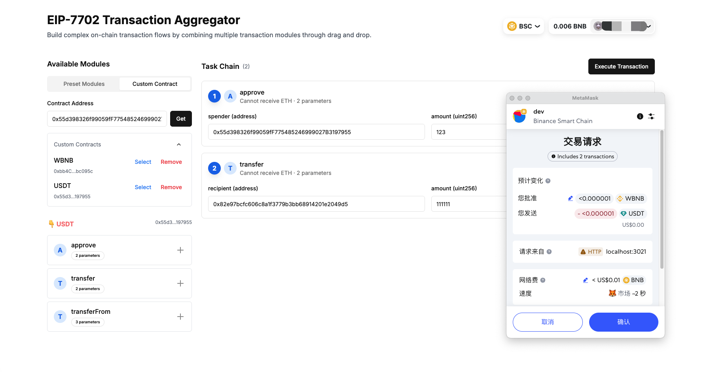

# EVM-7702 Transaction Aggregator

A transaction aggregator based on EVM-7702 that allows users to combine multiple transaction modules through drag-and-drop to build complex transaction chains.



## Features

### 1. Modular Transactions
- **Token Approve** (🔓)
  - Approve tokens for specified addresses
  - Support custom approval amounts
  - Flexible spender address configuration

- **Token Transfer** (💸)
  - Transfer tokens to specified addresses
  - Support custom transfer amounts
  - Compatible with any ERC20 tokens

- **Token Swap** (🔄)
  - Swap tokens on DEX
  - Support major tokens (USDC, USDT, ETH, WBTC)
  - Configurable slippage protection

### 2. User Experience
- Intuitive drag-and-drop interface
- Modular card design
- Real-time form validation
- User-friendly empty state
- Transaction execution status feedback

### 3. Wallet Integration
- Rainbow Kit wallet connection support
- Compatible with major Web3 wallets
- Transaction signing and execution

## Tech Stack

- **Frontend Framework**: Next.js
- **UI Components**: 
  - shadcn/ui
  - Tailwind CSS
- **Web3 Integration**: 
  - wagmi
  - Rainbow Kit
- **State Management**: React Hooks
- **Drag and Drop**: @hello-pangea/dnd

## Quick Start

1. Clone the repository
```bash
git clone [repository-url]
cd evm-7702-aggregator
```

2. Install dependencies
```bash
npm install
```

3. Start the development server
```bash
npm run dev
```

4. Visit http://localhost:3000

## User Guide

1. **Connect Wallet**
   - Click the connect wallet button in the top right
   - Select and connect your Web3 wallet

2. **Add Transaction Modules**
   - Select required modules from the left panel
   - Click the "+" button to add modules to the transaction chain

3. **Configure Module Parameters**
   - Fill in required parameters (addresses, amounts, etc.)
   - System automatically validates parameters

4. **Adjust Execution Order**
   - Drag and drop to reorder modules
   - Order numbers update automatically

5. **Execute Transaction**
   - Verify all parameters
   - Click "Execute Transaction" button
   - Confirm transaction in your wallet

## Important Notes

- Ensure sufficient tokens and gas fees in your wallet
- Double-check all parameters before execution
- Recommended to test on testnet first

## Contributing

Issues and Pull Requests are welcome to help improve the project.

## License

MIT License 